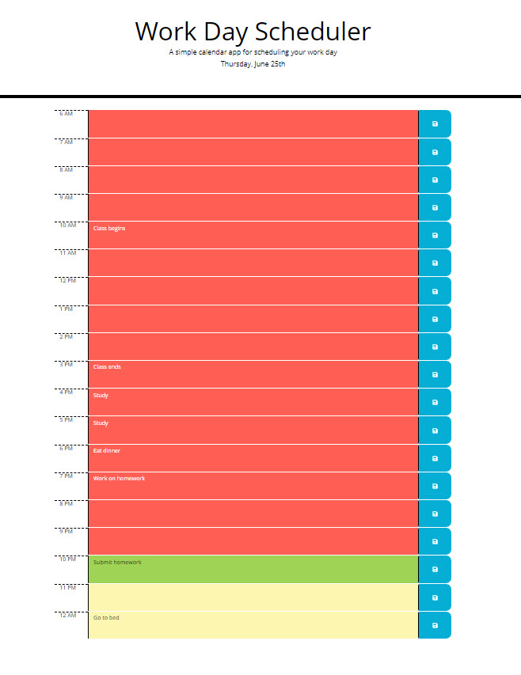

# HW5 Third-Party APIs: Work Day Scheduler

Calendar application that allows the user to save events for each hour of the day. This app will run in the browser and feature dynamically updated HTML and CSS powered by jQuery.

Plan your day by entering your details for each time block and the app will save it to your local storage.  Next time you open the app, the information that was previously saved will be retrieved and displayed.

The time blocks will change color based on if the the active block's time is less than the current time, equal to the current time, or if it's later than the current time.  

App URL: https://waltrevino.github.io/HW5/
Github repo: https://github.com/Waltrevino/HW5

